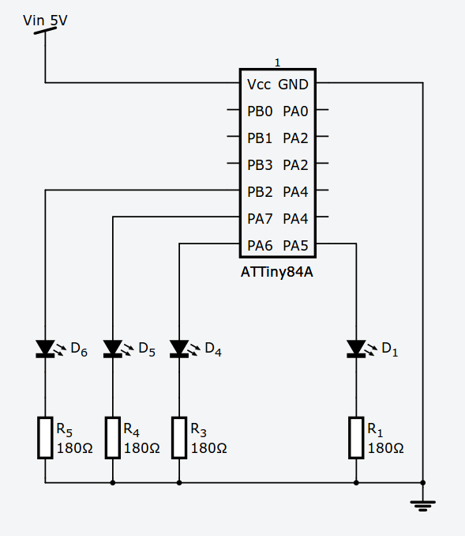

Fireflies
=========

LED firefly controller using the four PWM outputs of ATTiny84.  It uses the internal oscillator so the only external compoents required are the LEDs and current-limiting resistors.  There are only 4 PWM outputs on the ATTiny84A so that limits the design to 4 fireflies.

I powered it with a 4-AA battery pack, it should run fine on about 3.5-5V.

Schematic
=========

Design
======

The flash pattern of each firefly is controlled by a lookup table called PATTERN.  Each value in the table is the brightness value to be used.  The main loop

* chooses a random delay for each firefly and decrements the delay on each iteration of the loop
* when the delay hits 0, it starts iterating through the pattern
* stores the current position in the pattern in an array with one entry for each LED
* does a lookup in the PATTERN array for each LED and copies the value to the PWM registers
* waits 25msec before running again.

The pattern is based on this description: http://www.mun.ca/biology/scarr/Firefly_flashing.htm.
